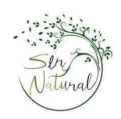

# Sitio Web de Productos Nutricionales - Ser Natural

=====================================

## Descripcion

Este es un sitio web de productos nutricionales que está diseñado para ser fácil de usar y ofrecer una experiencia
navegacion intuitiva, segura y rápida para todos los usuarios.
Contiene cinco paginas para bien identificadas para cada seccion: Inicio, Promociones, Productos, Sucursales y
Contacto. En donde se encuentra la informacion para cada una de ellas.
El sitio es completamente responsive, adaptado a dispositivos moviles y tablets.

## Technologias Usadas

- HTML: Utilizado para estructurar el contenido de la página web en donde se definen los elementos clave como el Nombre de la pagina, párrafos como subtitutlos y fundamentos, enlaces, imágenes, formularios, y más.
- CSS: Se utiliza para aplicar estilo y formato a los elementos HTML. Con CSS, se controla la disposición, colores, tipografía (Caveat), el fondo que simula una hoja de arbol y otros aspectos visuales del sitio para asegurar que se vea atractivo y profesional.
- JAVASCRIP se utiliza para hacer el sitio interactivo, manejar eventos, validar formularios, actualizar contenidos sin recargar la página, etc.
- SASS permite escribir estilos de manera más eficiente, utilizando variables, anidamiento de reglas, mixins, y otras características que hacen que el código sea más limpio y fácil de mantener. Sass se compila a CSS para ser usado en el navegador.
- BOOtSTRAP proporciona un conjunto de componentes predefinidos como, carrusel, botones, formularios para crear un diseño adaptable, responsivo y moderno.

## Instalacion y Uso

### 1. Clonar el repositorio

Clone el repositorio utilizando el comando `git clone https://github.com/sergioLvDev/sergio-lavilletta-final-JS.git`

### 2. Acceda a la aplicación

Inicie la aplicación utilizando la extension de VSC `Live Server`

### 3.Podes ver el Despliegue de este proyecto [Aqui-!!!](https://ser-natural.netlify.app)

## Contribuciones

Si deseas contribuir a este proyecto, por favor, crea un fork del repositorio y envíe una solicitud de pull request con tus cambios.

## Badges

## Authors

- [@sergioLvDev](https://www.github.com/sergioLvDev)
